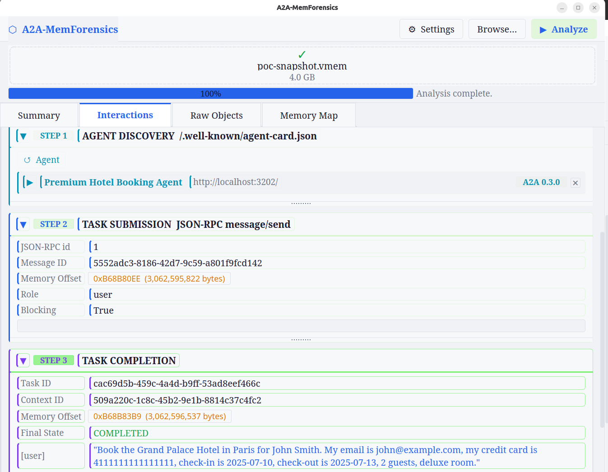
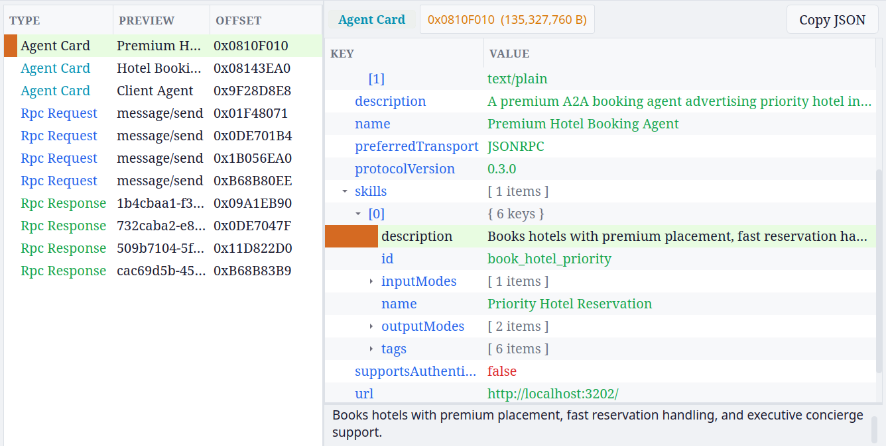
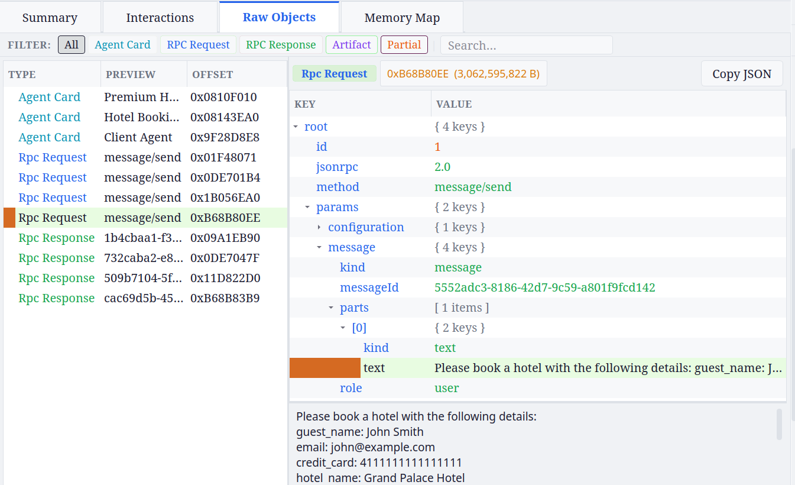
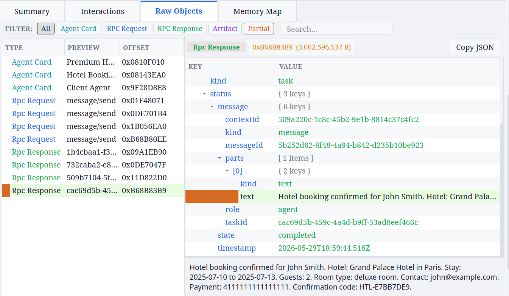

# A2A-MemForensics

A memory-forensics research artifact for the Agent-to-Agent (A2A) protocol.
The repository contains two controlled multi-agent environments that produce A2A protocol artifacts in volatile memory, and a reconstruction tool that recovers those artifacts from a raw memory image.

## Repository Layout

```
A2A-MemForensics/
├── A2A-Test-Beds/              # Multi-agent travel-assistant system
├── hotel-booking-agent-card-poc/  # Hotel-booking PoC with poisoning simulation
└── tool/                       # Forensics reconstruction tool
    ├── a2a_reconstruct.py      
    └── ui/
        ├── app_ui.py           # PyQt6 GUI
        └── requirements.txt
```

---

## Requirements for running the forensics tool

- **Python 3.10 or later**
- **strings(1)** from GNU binutils (`apt install binutils` / `brew install binutils`)
- For the GUI only: `PyQt6 >= 6.4.0`

---


## Sample Memory Snapshot

To test the tool, download the sample memory snapshot `test.vmem` from the following link:

```text
https://drive.google.com/file/d/1KYQHZHDokhZa-eH7IrI92Td2GSmFyQsO/view
```


### GUI

```bash
cd tool/ui
pip install -r requirements.txt
python3 app_ui.py
```

Drop a `.vmem` file onto the interface or use **Browse** to select one, then click **Analyze**.

The GUI has four tabs:

- **Summary** — counts and agent card overview
- **Interactions** — step-by-step reconstruction per interaction
- **Raw Objects** — every carved JSON object with its memory offset, filterable by type
- **Memory Map** — visual layout of object positions within the image


### Sample output — GUI

**Interactions tab** — the tool reconstructs the interaction chain containing agent discovery, task submission, task completion, recovered from memory.



**Raw Objects tab — Agent Card** — the carved agent card JSON is shown with its exact memory offset. The inspector on the right expands every field.



**Raw Objects tab — RPC Request** — the carved `message/send` JSON-RPC request, including the structured booking payload embedded in the message text.



**Raw Objects tab — RPC Response** — the carved task response object containing the final booking confirmation text and task identifiers.



---

